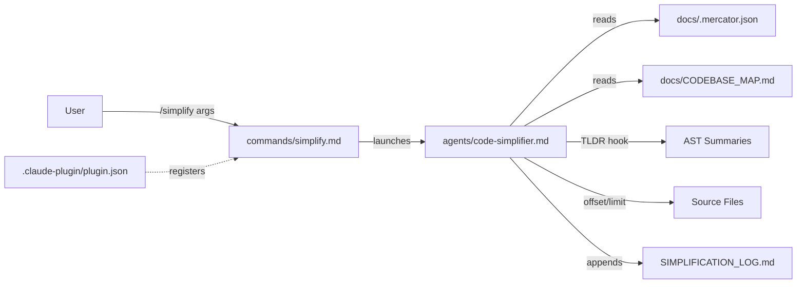
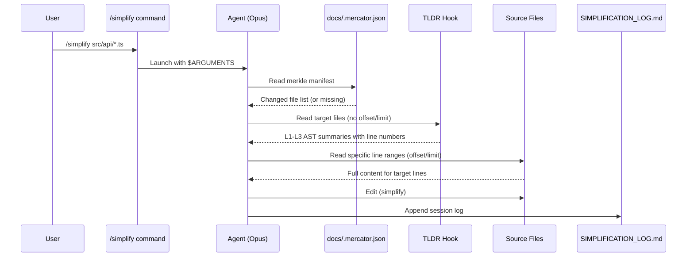

# Codebase Map

> Auto-generated by Mercator AI. Last mapped: 2026-02-13T20:30:44Z

## System Overview

A Claude Code plugin that simplifies code through a three-tier token-optimization strategy: merkle diff check (O(1)), TLDR AST summaries (95% savings), and line-range targeting (precise edits). Companion to mercator-ai, which provides the merkle manifest it reads.



## Directory Structure

```
code-simplifier-tldr/
├── .claude-plugin/
│   └── plugin.json          # Plugin manifest (name, version, keywords)
├── agents/
│   └── code-simplifier.md   # Core agent: TLDR + merkle protocol (2055 tokens)
├── commands/
│   └── simplify.md           # /simplify slash command entry point (406 tokens)
├── docs/
│   ├── .mercator.json        # Merkle manifest (auto-generated)
│   └── CODEBASE_MAP.md       # This file
├── CHANGELOG.md              # Version history (v1.0 → v2.0)
├── LICENSE                   # MIT (shihwesley, 2026)
├── README.md                 # Install, usage, token comparison tables
└── SIMPLIFICATION_LOG.md     # Append-only session history
```

## Module Guide

### Plugin Registration (`.claude-plugin/`)

**Purpose**: Registers the plugin with Claude Code's marketplace and CLI.

| File | Purpose | Tokens |
|------|---------|--------|
| `plugin.json` | Manifest with name, version 2.0.0, author, keywords | 212 |

**Key fields**: `name`, `version`, `description`, `keywords`, `repository`
**Consumed by**: Claude Code plugin loader (`/plugin install`)

---

### Agent Definition (`agents/`)

**Purpose**: The actual brain — defines the three-tier reading protocol and simplification rules.

| File | Purpose | Tokens |
|------|---------|--------|
| `code-simplifier.md` | Full agent protocol with merkle + TLDR workflow | 2055 |

**Key sections**:
- Pre-Simplification Context (4-step mandatory check)
- TLDR Integration Protocol (L1-L3 AST parsing)
- Core Principles (preserve behavior, enhance clarity)
- Token Budget Tables (96% savings with merkle)
- Logging Requirement (append to SIMPLIFICATION_LOG.md)

**Reads**: `docs/.mercator.json`, `docs/CODEBASE_MAP.md`, `CLAUDE.md`
**Writes**: Target source files (via Edit), `SIMPLIFICATION_LOG.md`
**Model**: `opus` (declared in frontmatter)

---

### Command Entry Point (`commands/`)

**Purpose**: Slash command that launches the agent with user-provided arguments.

| File | Purpose | Tokens |
|------|---------|--------|
| `simplify.md` | `/simplify` command definition with usage examples | 406 |

**Key behavior**: Receives `$ARGUMENTS` from CLI, delegates to agent protocol.
**Default**: If no args, targets files from `git diff --name-only HEAD~3`.
**Allowed tools**: Read, Write, Edit, Glob, Grep, Bash, Task (declared in frontmatter).

---

### Documentation & Metadata (root)

| File | Purpose | Tokens |
|------|---------|--------|
| `README.md` | Install instructions, usage, token comparison tables | 681 |
| `CHANGELOG.md` | v1.0.0 (initial) and v2.0.0 (merkle integration) | 211 |
| `SIMPLIFICATION_LOG.md` | Append-only session history with before/after diffs | 482 |
| `LICENSE` | MIT license, shihwesley 2026 | 222 |

## Data Flow



## Conventions

- **Agent frontmatter**: YAML block with `name`, `description`, `model`
- **Command frontmatter**: YAML with `argument-hint`, `allowed-tools`
- **TLDR line markers**: `# L45` format for line number references in AST summaries
- **Log format**: Session date header, metrics, before/after code blocks, rationale for exclusions
- **Separator**: `---` between log sessions (append-only)

## Gotchas

1. **Merkle is optional** — the agent handles both merkle and non-merkle paths. Without a manifest, it falls back to TLDR-only (still saves tokens, just not 96%).
2. **TLDR hook is required** — the agent assumes Read calls without `offset`/`limit` return AST summaries, not raw file content. Without the hook, the workflow breaks.
3. **Command name mismatch** — README shows `/simplify-tldr` in examples, but the command file registers as `/simplify`. Could confuse users.
4. **Self-referential log** — SIMPLIFICATION_LOG.md shows the agent was run on its own `agents/code-simplifier.md`, removing ~22 redundant lines.
5. **96% savings claim** — only with merkle manifest on a multi-file codebase (100 files, 3 changed). TLDR alone gives ~92% savings.
6. **No automatic triggers** — simplification is on-demand only. No git hooks or CI integration.

## Navigation Guide

**To modify the simplification rules**: Edit `agents/code-simplifier.md` — the "Core Principles" and "Refinement Process" sections.

**To change the command interface**: Edit `commands/simplify.md` — update `argument-hint`, usage examples, or default behavior.

**To bump the version**: Update both `.claude-plugin/plugin.json` (`version` field) and `CHANGELOG.md` (new section).

**To add a new command**: Create a new `.md` file in `commands/` with the same frontmatter pattern as `simplify.md`.

**To review past simplification runs**: Read `SIMPLIFICATION_LOG.md` — each session has metrics and before/after diffs.
